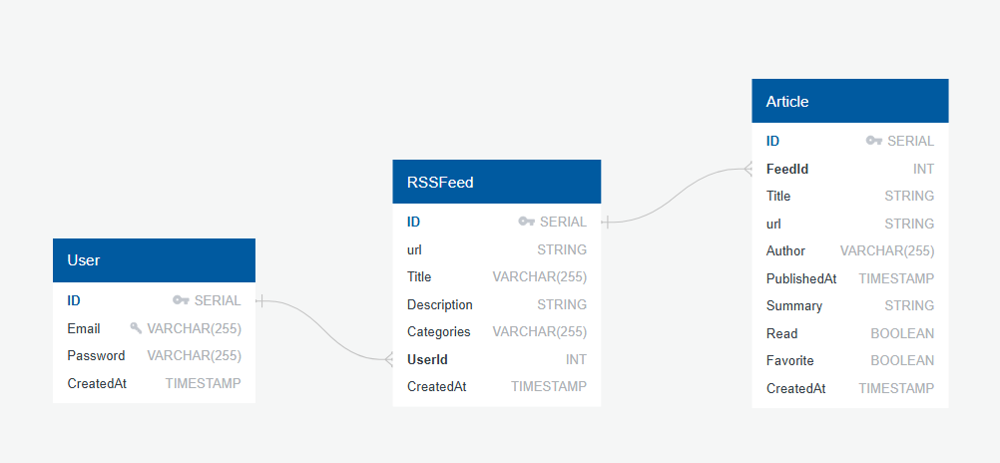

Documentation technique – SUPRSS

# 1. Introduction

SUPRSS est une application web de gestion et de lecture de flux RSS développée pour la société InfoFlux Pro.

Elle permet aux utilisateurs de :

* S’inscrire et se connecter

* Ajouter/organiser des flux RSS,

* Lire les articles associés (avec suivi lu/non-lu, favoris),

* Filtrer/rechercher dans les articles,

* Exporter/Importer des flux (JSON, CSV, OPML),

Le projet suit une architecture 3-tiers (API REST, base de données, client web).

---

# 2. Architecture

## 2.1 Schéma global


### Dépendances principales

Front : Axios, Nginx

API : Express, Prisma, bcrypt, node-cron

Déploiement : Docker Compose

## 2.2 Conteneurs Docker

db : PostgreSQL avec volume persistant (/db-data).

api : serveur Node.js (Express).

web : front React, servi via Nginx + proxy /api → API.

## 2.3 Schéma de la base de données



## 2.4 Sécurité

- Mot de passe hashés avec bcrypt
- JWT pour les sessions persistantes
- Nginx sert pour le front et proxifie /api

# 3. Déploiement

## 3.1 Prérequis

- Docker & Docker Desktop

- Git

## 3.2 Lancement

### Installation 

Cloner le repository : ```git clone https://github.com/alexisgrandmaitre/SUPRSS```

À la racine ```docker compose build```

Puis ```docker compose up```

- Front accessible : http://localhost

- API santé : http://localhost/api/health

### Lancement en dev

DB via Docker : ```docker compose up -d db```

API : 

```cd API```

```cp .env.example .env```

```npm install```

```npx prisma migrate dev```

```npm run dev```


Front :

```cd front```

```echo VITE_API_BASE=http://localhost:3001 > .env.local```

```npm install```

```npm run dev```

# 4. Routes API

- Toutes les routes sont préfixées par /api/...

## 4.1 Authentification

### POST /register

Créer un nouvel utilisateur

- Exemple :
```
{
  "email": "user@example.com",
  "password": "monMotDePasse"
}
```
- Réponse :

```
{
  "user": {
    "id": 1,
    "email": "user@example.com"
  }
}
```
### POST /login

Connexion d'un utilisateur existant

- Exemple :

```
{
  "email": "user@example.com",
  "password": "monMotDePasse"
}
```
- Réponse :

```
{
  "user": {
    "id": 1,
    "email": "user@example.com"
  }
}
```

## 4.2 Gestion des flux

### GET /rssfeeds/:userId

Liste tous les flux d'un utilisateur

Paramètre d'URL : "userId"(int) -> identifiant de l'utilisateur

- Réponse :

```
[
  {
    "id": 1,
    "url": "https://www.lemonde.fr/rss/une.xml",
    "title": "Le Monde",
    "description": "Actualités",
    "categories": "actu",
    "userId": 1
  }
]
```

### POST /rssfeeds

Ajouter un flux pour un utilisateur

- Exemple :

```
{
  "title": "Le Monde",
  "url": "https://www.lemonde.fr/rss/une.xml",
  "description": "Actualités",
  "categories": "actu",
  "userId": 1
}
```

- Réponse :

```
{
  "id": 1,
  "title": "Le Monde",
  "url": "https://www.lemonde.fr/rss/une.xml",
  "userId": 1
}
```

### DELETE /rssfeeds/:id

Supprimer un flux RSS

Paramètre d'url : "id"(int) -> Identifiant du flux

- Réponse : 

```
{ "success": true }
```

### POST /rssfeeds/:id/refresh

Forcer le rafraichissemennt des articles pour un flux

Paramètre d'url : "id"(int) -> Identifiant du flux

```
{ "success": true, "articlesCreated": 5 }
```

## 4.3 Gestion des articles

### GET /articles/:feedId

Liste les articles d'un flux

Paramètre d'url : "feedId"(int)

- Réponse :

```
[
  {
    "id": 10,
    "title": "Titre de l'article",
    "url": "https://site.com/article",
    "author": "Auteur",
    "publishedAt": "2025-08-01T12:00:00Z",
    "summary": "Résumé",
    "read": false,
    "favorite": false,
    "feedId": 1
  }
]
```

### PATCH /articles/:id/read

Marquer comme lu / non lu

Paramètre d'url : "id"(int)

- Exemple :

```
{ "read": true }
```

- Réponse :

```
{ "success": true }
```
### PATCH /articles/:id/favorite

Marquer comme favori / non favori

Paramètre d'url : "id"(int)

- Exemple :

```
{ "favorite": true }
```

- Réponse :

```
{ "success": true }
```

## 4.4 Export

### GET /export/opml?userId=1

Exporter tous les flux d'un utilisateur au format OPML

### GET /export/json?userId=1&withArticles=true

Exporter tous les flux d'un utilisateur au format JSON

### GET /export/csv?userId=1

Exporter tous les flux d'un utilisateur au format CSV.

## 4.5 Import

### POST /import/opml

Importer un fichier opml de flux

- FormData
    - file: fichier opml


## 4.6 Automatisation

### POST /cron/refresh

Déclencher manuellement le rafraichissement de tous les flux

- Réponse :

```
{ "ok": true }
```


# 5. Guide développeur

Fork/cloner le repo.

Installer dépendances (front + API).

Lancer via Docker ou local.

Migrations Prisma à chaque évolution du schéma.

Pour ajouter une feature :

Définir modèle Prisma,

Exécuter npx prisma migrate dev,

Ajouter route dans index.js,

Créer composant React si besoin.