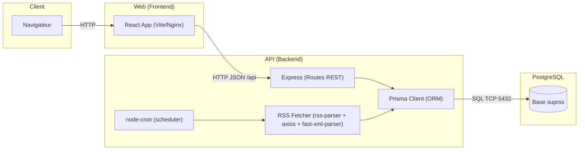
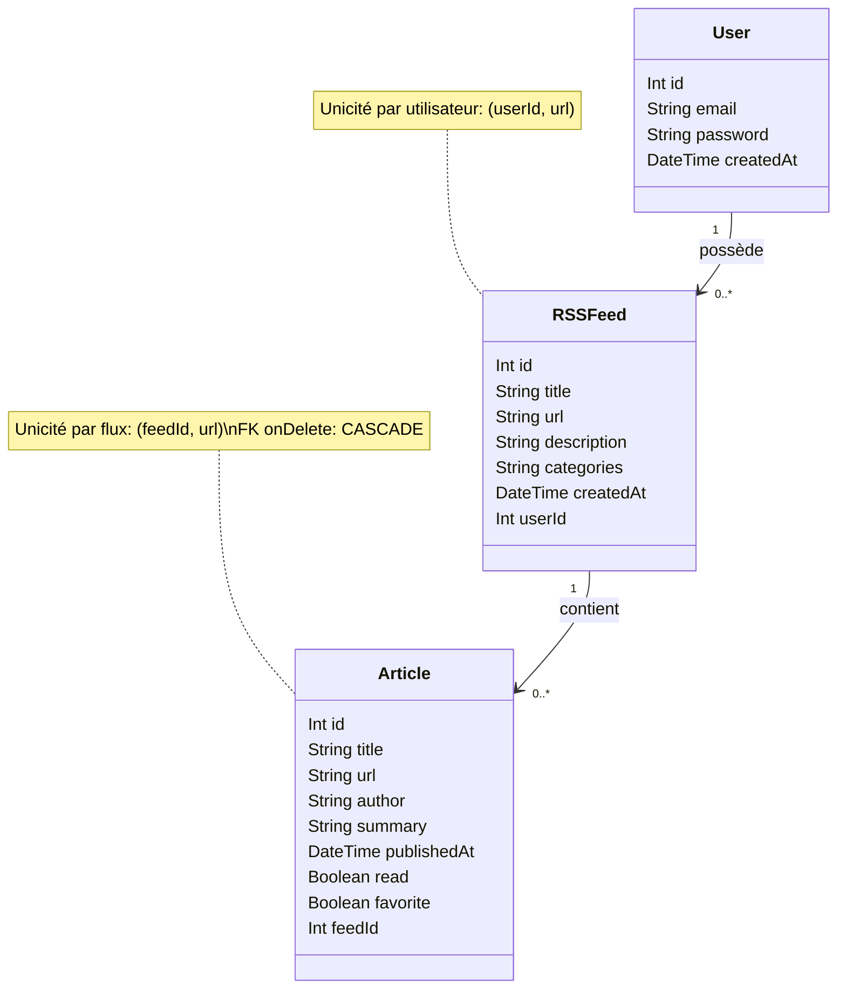
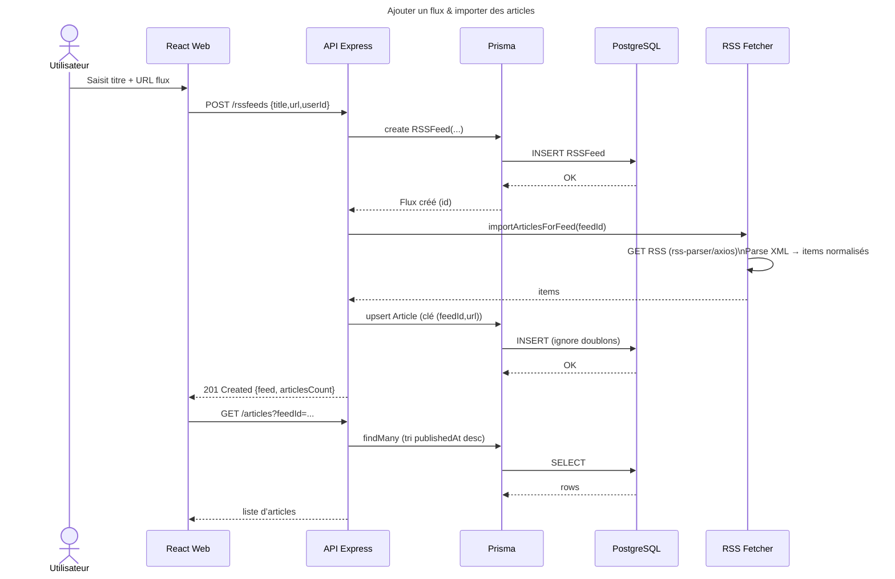

# Documentation technique – SUPRSS

## 1. Présentation du projet
- 1.1 Contexte et objectifs
- 1.2 Fonctionnalités principales
- 1.3 Technologies utilisées
- 1.4 Architecture globale du système

## 2. Service : Base de données (DB)
- 2.1 Présentation du service
- 2.2 Architecture et schéma relationnel
- 2.3 Prérequis et installation
- 2.4 Configuration
- 2.5 Gestion des migrations Prisma

## 3. Service : API (Backend)
- 3.1 Présentation du service
- 3.2 Architecture logicielle
- 3.3 Prérequis et installation
- 3.4 Configuration
- 3.5 Fonctions principales

## 4. Service : Web (Frontend)
- 4.1 Présentation du service
- 4.2 Architecture
- 4.3 Prérequis et installation
- 4.4 Configuration
- 4.5 Fonctionnalités UI

## 5. Déploiement avec Docker Compose
- 5.1 Présentation du déploiement multi-services
- 5.2 Contenu du fichier `docker-compose.yml`
- 5.3 Variables d’environnement globales
- 5.4 Commandes principales

## 6. Diagramme et schéma

- 6.1 Diagramme d’architecture (composants)
- 6.2 Schéma de données
- 6.3 Diagramme de séquence (ajout d’un flux + import)

# 1. Présentation du projet

## 1.1 Contexte et objectifs
**SUPRSS** est une application web de lecture et de gestion de flux RSS destinée aux employés et clients d’**InfoFlux Pro**.  

- des **comptes utilisateurs** indépendants ;
- l’**abonnement** à des flux RSS variés (presse, blogs, YouTube, podcasts…) ;
- la **persistance** des articles (pour contrer la volatilité des flux) ;
- des outils de **classement** (lu/non lu, favoris) et de **recherche/filtrage** ;
- l’**export** des abonnements (et éventuellement des articles) pour faciliter la portabilité ;

---

## 1.2 Fonctionnalités principales
- **Comptes & authentification**
  - Création de compte et connexion (mot de passe hashé avec bcrypt).

- **Gestion des flux**
  - Ajout / suppression de flux RSS par utilisateur.
  - Métadonnées : titre, description, catégories (_tags_).
  - **Rafraîchissement** manuel et **cron** automatique.
  - Unicité par utilisateur (`(userId, url)`).

- **Articles**
  - Récupération et stockage des articles (titre, lien, auteur, date, résumé).
  - **Lu / non lu**, **favoris**.
  - **Recherche** plein texte (titre, résumé, auteur).
  - **Filtres** : statut (lus/non lus), favoris, **catégories/tags** (via le flux), source.

- **Import / Export**
  - **Export** des flux en **OPML**, **JSON**, **CSV**.
  - **Import** OPML

---

## 1.3 Technologies utilisées

- **Frontend : React + Vite**
  - **React** : framework JavaScript moderne, adapté aux interfaces dynamiques et aux composants réutilisables.
  - **Vite** : outil de build ultra-rapide, permet un hot reload efficace en développement.
  - **Justification** : combinaison légère, standard dans l’industrie, idéale pour un projet académique ou professionnel.

- **Backend : Node.js + Express**
  - **Node.js** : runtime performant, particulièrement adapté aux API et aux opérations I/O (ex. appels RSS).
  - **Express** : framework minimaliste pour créer une API REST robuste et extensible.
  - **Justification** : écosystème riche, simplicité d’utilisation, très répandu → facilite la maintenance et le travail en équipe.

- **Base de données : PostgreSQL**
  - SGBD relationnel open-source robuste et fiable.
  - Supporte les relations, contraintes d’unicité, transactions, et types avancés (JSON).
  - **Justification** : parfait pour gérer les relations **User → Flux → Articles**, garantit l’intégrité des données.

- **ORM : Prisma**
  - ORM moderne et typé, compatible TypeScript/JavaScript.
  - Génère automatiquement un client basé sur le schéma de la base.
  - **Justification** : évite les requêtes SQL manuelles, améliore la lisibilité et la productivité, facilite les migrations.

- **Récupération RSS : rss-parser + axios + fast-xml-parser**
  - **rss-parser** : librairie simple et efficace pour parser les flux RSS.
  - **axios** : fallback HTTP, utilisé pour certaines sources qui nécessitent un User-Agent spécifique.
  - **fast-xml-parser** : fallback pour parser les flux XML manuellement.
  - **Justification** : combinaison robuste permettant de gérer les flux RSS “propres” comme les flux plus stricts.

- **Sécurité : bcrypt**
  - **bcrypt** : algorithme de hashage des mots de passe, standard de facto pour sécuriser les credentials.
  - **Justification** : garantit la sécurité des utilisateurs (mots de passe jamais stockés en clair), extensible pour le futur avec JWT/OAuth2.

- **Automatisation : node-cron**
  - Permet de planifier des tâches (rafraîchissement périodique des flux).
  - **Justification** : assure la mise à jour régulière des articles sans intervention manuelle.

- **Déploiement : Docker + Docker Compose**
  - **Docker** : conteneurisation des services (db, api, web).
  - **Docker Compose** : orchestration multi-services (lancement en une commande).
  - **Justification** : simplifie l’installation et le rendu du projet, portable entre environnements (Windows, Linux, Mac).

- **Serveur web (production) : Nginx**
  - Sert l’application frontend (build React).
  - Reverse proxy pour rediriger `/api` vers le backend.
  - **Justification** : fiable, léger, standard industriel.


---

## 1.4 Architecture globale du système
**Vue d’ensemble :**


- Le **Frontend** (service `web`) affiche l’interface, appelle l’API et gère l’état (utilisateur, flux, articles, filtres).
- L’**API** (service `api`) expose des endpoints REST : inscription/connexion, gestion des flux, articles, import/export, cron.
- La **DB** (service `db`) stocke utilisateurs, flux, articles, avec clés étrangères et contraintes d’unicité.
- Le tout est orchestré par **Docker Compose** (réseau interne privé ; l’API voit la DB via `host=db`).

# 2. Service : Base de données (DB)

## 2.1 Présentation du service
La base de données est le cœur de l’application **SUPRSS**.  
Elle gère la persistance des informations critiques :
- **Utilisateurs** : comptes, identifiants de connexion.
- **Flux RSS** : métadonnées des flux (titre, URL, description, tags).
- **Articles** : contenu importé des flux, marqué lu/non-lu, favori ou non.

La base utilisée est **PostgreSQL**.

---

## 2.2 Architecture et schéma relationnel
La base est relationnelle et suit le modèle suivant :

- **User**
  - `id` *(PK, Int, auto-incrément)*  
  - `email` *(String, unique)*  
  - `password` *(String, hashé avec bcrypt)*  
  - `createdAt` *(DateTime)*  

- **RSSFeed**
  - `id` *(PK, Int, auto-incrément)*  
  - `title` *(String)*  
  - `url` *(String, unique par utilisateur)*  
  - `description` *(String, optionnel)*  
  - `categories` *(String, optionnel – tags séparés par virgule)*  
  - `createdAt` *(DateTime)*  
  - `userId` *(FK → User.id, onDelete: Cascade)*  

- **Article**
  - `id` *(PK, Int, auto-incrément)*  
  - `title` *(String)*  
  - `url` *(String, unique par flux – contrainte (feedId, url))*  
  - `author` *(String, optionnel)*  
  - `summary` *(String, optionnel)*  
  - `publishedAt` *(DateTime, optionnel)*  
  - `read` *(Boolean, default: false)*  
  - `favorite` *(Boolean, default: false)*  
  - `feedId` *(FK → RSSFeed.id, onDelete: Cascade)*  

Schéma de la base de données


---

## 2.3 Prérequis et installation
- **PostgreSQL** version 16 (image officielle `postgres:16-alpine`).
- Pas besoin d’installation manuelle → le service est géré automatiquement via **Docker Compose**.
- Volume dédié (`db-data`) pour conserver les données entre redémarrages.

## 2.4 Configuration

|Variables         | Description                          |
|------------------|--------------------------------------|
|POSTGRES_USER     | Nom de l'utilisateur PostgreSQL      |
|POSTGRES_PASSWORD | Mot de passe associé                 |
|POSTGRES_DB       | Nom de la base créée automatiquement |

## 2.5 Gestion des migrations Prisma

L’ORM Prisma gère la création et la mise à jour du schéma de la base.
- Les modèles sont définis dans `API/prisma/schema.prisma`
- Les migrations sont versionnées dans `API/prisma/migrations/`

Commandes principales (à exécuter depuis `API/`) :

```
# Créer une nouvelle migration après modification du schema.prisma
npx prisma migrate dev --name <nom_migration>

# Synchroniser le client Prisma
npx prisma generate
```

Lors du déploiement Docker, les migrations sont appliquées automatiquement pour garantir la cohérence du schéma.

# 3. Service : API (Backend)

## 3.1 Présentation du service
Le service **API** expose les fonctionnalités de SUPRSS via une **API REST**.  
Il est responsable de :
- l’**authentification** (inscription / connexion) ;
- la **gestion des flux** (CRUD minimal, rafraîchissement) ;
- l’**ingestion** des articles RSS (avec déduplication) ;
- la **lecture** (lu/non-lu), les **favoris**, la **recherche** et les **filtres** ;
- l’**export** / **import** des abonnements ;
- l’**orchestration** d’un **cron** de rafraîchissement.


---

## 3.2 Architecture logicielle
**Organisation (répertoire `API/`)** :

```
API/
├─ Dockerfile
├─ index.js
├─ package.json
├─ prisma/
  ├─ schema.prisma
  └─ migrations/
```


**Flux d’exécution (vue d’ensemble)** :
1. Express démarre, connecte **Prisma** à la base.
2. Les **routes REST** sont exposées (auth, flux, articles, export/import).
3. Un **cron** (node-cron) peut déclencher périodiquement l’import RSS.
4. `rss-parser` récupère les flux ; si la source est stricte (ex. User-Agent requis), **fallback** via `axios` + `fast-xml-parser`.
5. Les articles sont **persistés** (contrainte d’unicité `(feedId, url)`).
6. Les opérations de lecture/favoris et les **filtres** sont réalisées côté API pour soulager le front.

> **Notes techniques**
> - Les routes sont **stateless** ; le front gère la session côté client.
> - Les opérations sensibles (suppression d’un flux) s’appuient sur la **cascade** en base ou une **transaction** qui supprime d’abord les articles.

---

## 3.3 Prérequis et installation

### Exécution locale (dev)

```
bash
# 1) Variables d’environnement
cp .env.example .env              # vérifie DATABASE_URL, PORT

# 2) Dépendances
npm install

# 3) Prisma
npx prisma migrate dev            # crée/maj la base à partir de schema.prisma
npx prisma generate               # génère le client Prisma

# 4) Lancer l’API (dev)
npm run dev                       # via nodemon, par ex. http://localhost:30
```
Exécution via Docker Compose

Le service `api` est construit et lancé par `docker-compose.yml` à la racine :

```
docker compose up -d --build
```

Les migrations Prisma sont appliquées au démarrage (si votre image/entrypoint les exécute, ou via `migrate deploy` dans le Dockerfile/command).

## 3.4 Configuration

Variables lues par l’API (dans `API/.env` ou injectées par Compose) :

|Variables    | Description                            |
|-------------|----------------------------------------|
|PORT         | Port HTTP de l’API                     |
|DATABASE_URL | Chaîne de connexion Postgres           |
|POSTGRES_DB  | Nom de la base créée automatiquement   |


Important : en Docker, l’hôte Postgres est `db` (réseau interne). En local (hors Docker), utilisez `localhost`.

## 3.5 Fonctions principales

## Authentification

### POST /register

Créer un nouvel utilisateur

- Exemple :
```
{
  "email": "user@example.com",
  "password": "monMotDePasse"
}
```
- Réponse :

```
{
  "user": {
    "id": 1,
    "email": "user@example.com"
  }
}
```
### POST /login

Connexion d'un utilisateur existant

- Exemple :

```
{
  "email": "user@example.com",
  "password": "monMotDePasse"
}
```
- Réponse :

```
{
  "user": {
    "id": 1,
    "email": "user@example.com"
  }
}
```

## Gestion des flux

### GET /rssfeeds/:userId

Liste tous les flux d'un utilisateur

Paramètre d'URL : "userId"(int) -> identifiant de l'utilisateur

- Réponse :

```
[
  {
    "id": 1,
    "url": "https://www.lemonde.fr/rss/une.xml",
    "title": "Le Monde",
    "description": "Actualités",
    "categories": "actu",
    "userId": 1
  }
]
```

### POST /rssfeeds

Ajouter un flux pour un utilisateur

- Exemple :

```
{
  "title": "Le Monde",
  "url": "https://www.lemonde.fr/rss/une.xml",
  "description": "Actualités",
  "categories": "actu",
  "userId": 1
}
```

- Réponse :

```
{
  "id": 1,
  "title": "Le Monde",
  "url": "https://www.lemonde.fr/rss/une.xml",
  "userId": 1
}
```

### DELETE /rssfeeds/:id

Supprimer un flux RSS

Paramètre d'url : "id"(int) -> Identifiant du flux

- Réponse : 

```
{ "success": true }
```

### POST /rssfeeds/:id/refresh

Forcer le rafraichissemennt des articles pour un flux

Paramètre d'url : "id"(int) -> Identifiant du flux

```
{ "success": true, "articlesCreated": 5 }
```
## Gestion des articles

### GET /articles/:feedId

Liste les articles d'un flux

Paramètre d'url : "feedId"(int)

- Réponse :

```
[
  {
    "id": 10,
    "title": "Titre de l'article",
    "url": "https://site.com/article",
    "author": "Auteur",
    "publishedAt": "2025-08-01T12:00:00Z",
    "summary": "Résumé",
    "read": false,
    "favorite": false,
    "feedId": 1
  }
]
```

### PATCH /articles/:id/read

Marquer comme lu / non lu

Paramètre d'url : "id"(int)

- Exemple :

```
{ "read": true }
```

- Réponse :

```
{ "success": true }
```
### PATCH /articles/:id/favorite

Marquer comme favori / non favori

Paramètre d'url : "id"(int)

- Exemple :

```
{ "favorite": true }
```

- Réponse :

```
{ "success": true }
```
## Export

### GET /export/opml?userId=1

Exporter tous les flux d'un utilisateur au format OPML

### GET /export/json?userId=1&withArticles=true

Exporter tous les flux d'un utilisateur au format JSON

### GET /export/csv?userId=1

Exporter tous les flux d'un utilisateur au format CSV.

## Import

### POST /import/opml

Importer un fichier opml de flux

- FormData
    - file: fichier opml


## Automatisation

### POST /cron/refresh

Déclencher manuellement le rafraichissement de tous les flux

- Réponse :

```
{ "ok": true }
```

# 4. Service : Web (Frontend)

## 4.1 Présentation du service
Le service **Web** fournit l’interface utilisateur de SUPRSS.  
Il est développé en **React** (avec **Vite** pour le bundling et le hot reload en dev).  
Objectifs :
- offrir une interface claire et ergonomique pour gérer ses flux RSS et lire ses articles ;
- interagir exclusivement avec l’API backend (aucune logique métier côté client) ;
- proposer des fonctionnalités de filtrage et de recherche simples et rapides.

En production, l’application React est construite puis servie par **Nginx** (conteneur `web`).  
En développement, elle est exécutée via le serveur intégré de **Vite** (`npm run dev`).

---

## 4.2 Architecture
Organisation typique des fichiers (répertoire `front/`) :

```
front/
├─ Dockerfile # Image front (build React + Nginx)
├─ package.json
├─ vite.config.js
└─ src/
  ├─ App.jsx # Entrée principale
  ├─ Login.jsx # Page de connexion
  ├─ Register.jsx # Page d’inscription
  ├─ FeedsList.jsx # Liste et gestion des flux
  ├─ ArticlesList.jsx # Liste des articles d’un flux
  ├─ FiltersBar.jsx # Barre de filtres (tags, favoris, statut, recherche)
  ├─ api.js # Client axios centralisé vers l’API
  └─ styles.css # Styles globaux
```


Flux utilisateur :
1. Connexion ou inscription → stockage du compte (et JWT si activé) dans `localStorage`.
2. Affichage des flux de l’utilisateur (liste de gauche).
3. Sélection d’un flux → récupération des articles associés.
4. Interaction : marquer lu/non lu, mettre en favoris, filtrer ou rechercher.
5. (Optionnel) Export de ses flux/articles.

---

## 4.3 Prérequis et installation

### Exécution locale (dev)

```bash
# Installer les dépendances
npm install

# Lancer le serveur Vite (port 5173 par défaut)
npm run dev
```

Accès via : http://localhost:5173

### Execution via Docker Compose

Le service `web` est défini dans `docker-compose.yml` :

```
docker compose up -d --build
```

Accès via : http://localhost (port 80 par défaut, proxifié par Nginx).

## 4.4 Configuration

|Variables    | Description                                                      |
|-------------|------------------------------------------------------------------|
|VITE_API_URL | URL de l’API backend (par défaut http://localhost:3001)          |
|WEB_PORT     | Port exposé en local par le conteneur web (ex: 80 ou 5173 en dev)|

Exemple de configuration (dans `.env` à la racine) :

```
VITE_API_URL=http://localhost:3001
WEB_PORT=80
```

## 4.5 Fonctionnalités UI

- Authentification
    - Page Login : formulaire connexion → envoie requête `/login`.
    - Page Register : formulaire inscription → envoie requête `/register`.
    - Persistance utilisateur (localStorage) → évite reconnexion après refresh.

- Gestion des flux
    - Liste des flux à gauche (`FeedsList.jsx`).
    - Ajout/suppression de flux → appel API `/rssfeeds`.
    - Actualisation (manuel + automatique).

- Lecture des articles
    - Liste des articles (`ArticlesList.jsx`).
    - Marquer lu/non lu (bouton → API `/articles/:id/read`).
    - Ajouter/enlever des favoris (bouton → API `/articles/:id/favorite`).

- Filtres et recherche
    - Barre de filtres (`FiltersBar.jsx`) :
    - par source (flux)
    - par catégories (tags des flux)
    - par statut (lus / non lus)
    - par favoris
    - recherche plein texte

- Export
    - Boutons pour récupérer ses flux/articles (JSON, CSV, OPML).


# 5. Déploiement avec Docker Compose

## 5.1 Présentation du déploiement multi-services
Le projet SUPRSS est livré avec un **déploiement en un seul fichier** via **Docker Compose**.  
Il orchestre 3 services indépendants mais reliés par un réseau privé Docker :

- **db** : PostgreSQL (stockage persistant via volume `db-data`)
- **api** : Backend Node.js/Express + Prisma (expose `:3001`)
- **web** : Frontend React (build + Nginx en prod) (expose `:80`)

Objectifs :
- **Reproductibilité** (même environnement chez tous les correcteurs)
- **Isolation** des services
- **Démarrage en 1 commande** : `docker compose up -d --build`

---

## 5.2 Contenu du `docker-compose.yml`
> Fichier situé **à la racine** du projet.

```yaml
version: "3.9"

services:
  db:
    image: postgres:16-alpine
    container_name: suprss_db
    restart: unless-stopped
    env_file: .env
    environment:
      POSTGRES_USER: ${POSTGRES_USER}
      POSTGRES_PASSWORD: ${POSTGRES_PASSWORD}
      POSTGRES_DB: ${POSTGRES_DB}
    volumes:
      - db-data:/var/lib/postgresql/data
    ports:
      - "5432:5432"

  api:
    build:
      context: ./API
    container_name: suprss_api
    restart: unless-stopped
    depends_on:
      - db
    env_file: .env
    environment:
      NODE_ENV: production
      PORT: ${API_PORT:-3001}
      DATABASE_URL: postgresql://${POSTGRES_USER}:${POSTGRES_PASSWORD}@db:5432/${POSTGRES_DB}?schema=public
      JWT_SECRET: ${JWT_SECRET}
    ports:
      - "${API_PORT:-3001}:3001"

  web:
    build:
      context: ./front
    container_name: suprss_web
    restart: unless-stopped
    depends_on:
      - api
    ports:
      - "${WEB_PORT:-80}:80"

volumes:
  db-data:

```

Points clés :

- `env_file: .env` : les identifiants sont externalisés (pas en clair dans Git).
- `db` persiste ses données dans le volume `db-data`.
- `api` parle à `db` via le host docker `db` (pas `localhost`).
- `web` expose 80 par défaut (modifiable via `WEB_PORT`).

## 5.3 Commandes principales

### Démarrer (Build + run)

```
docker compose up -d --build
```

### Arrêter et supprimer (en gardant les données DB)

```
docker compose down
```

### Arrêter et supprimer avec données

```
docker compose down -v --remove-orphans
```

### Rebuild sans cache

```
docker compose build --no-cache --pull
```

### Logs

```
docker compose logs -f

docker compose logs -f api
docker compose logs -f db
docker compose logs -f web
```

### Statut des services

```
docker compose ps
```

# 6. Diagramme et Schéma

## 6.1 Diagramme d’architecture (composants)



## 6.2 Schéma de données



## 6.3 Diagramme de séquence (ajout d’un flux + import)

