# Manuel utilisateur — SUPRSS

## 1. Présentation

- Objectif : SUPRSS est un lecteur/agrégateur de flux RSS. Il permet d’ajouter des flux, lire les articles, les marquer en lu/non lu, mettre des favoris, rechercher et filtrer, ainsi qu’importer/exporter ses flux.

- Prérequis :

    - Un navigateur récent (Chrome, Edge, Firefox, Safari à jour).
    - Une connexion Internet.
    - Une URL d’accès.

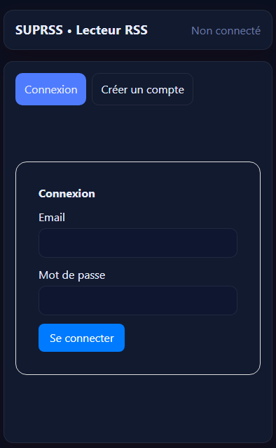

## 2. Premières étapes

URL de l'application : http://localhost

### 2.1 Création d'un compte

1. Ouvrir l'application

2. Cliquez sur "Créer un compte"

3. Saisir email et mot de passe et comfirmer le mot de passe

4. Valider. Vous serez automatiquement connecté.

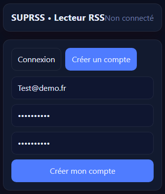

### 2.2 Se connecter

1. Ouvrir l'application

2. Cliquer sur connexion

3. Entrer vos identifiants

4. Valider

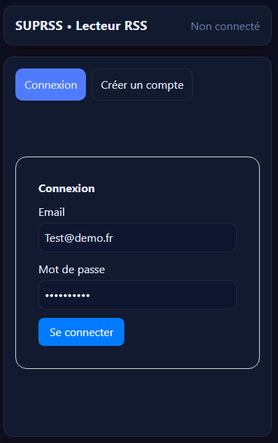

### 2.3 Se déconnecter

- Cliquer sur "Déconnexion" en haut de la page.

## 3. Gérer les flux

### 3.1 Ajouter un flux

1. Dans le panneau "Mes flux" remplir

- Titre

- URL du flux

- Description

- Catégories

2. Cliquer sur ajouter un flux

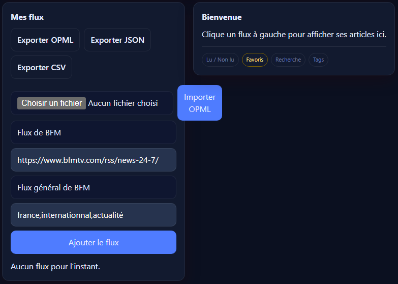

### 3.2 Afficher les articles d'un flux

- Cliquer sur le nom du flux dans la liste

Les articles s'affichent dans le panneau de droite

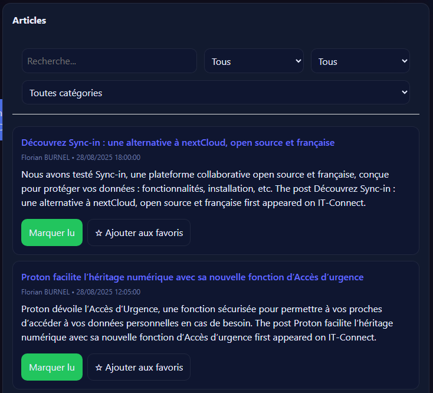

### 3.3 Rafraîchir les articles

- Dans la carte d'un flux, cliquer sur "Rafraîchir" pour importer les nouveaux articles

- Un Rafraîchissement automatique tourne périodiquement en arrière-plan

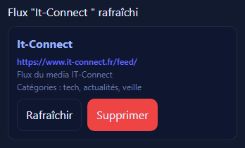

### 3.4 Supprimer un flux

- Cliquer sur "Supprimer" sur la carte du flux

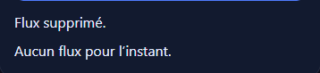

## 4. Lire et organiser ses articles

### 4.1 Ouvrir un article

- Cliquer sur le titre de l'article : il s'ouvre dans un nouvel onglet vers la source

### 4.2 Marquer en "Lu/Non lu"

- Utiliser le bouton Marquer lu / Marquer non lu

- Les articles "lus" s'affichent en léger translucide.

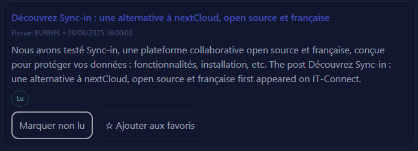

### 4.3 Ajouter / Retirer des favoris

- Cliquer sur "Ajouter aux favoris / Retirer des favoris"
- Les favoris peuvent être filtrés (Voir la section filtres)

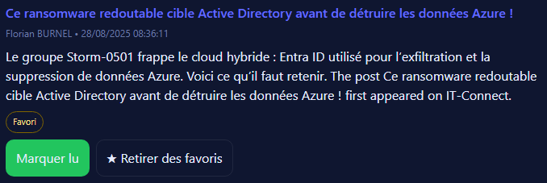

## Rechercher et filtrer

### 5.1 Barre de recherche

- Saisir des mots-clés dans Recherche… (titre, résumé, auteur).
- Le filtrage s’applique aux articles affichés (flux sélectionné).

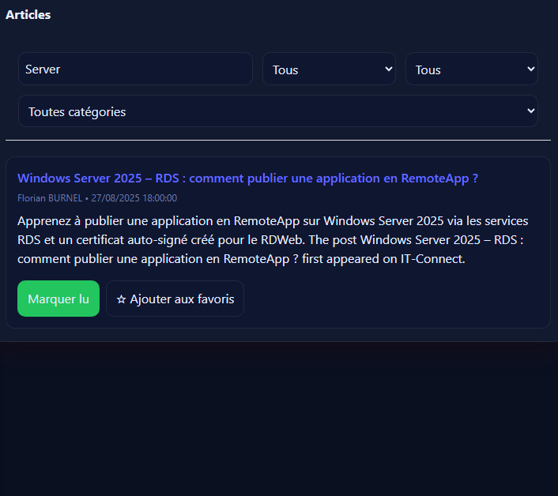

### 5.2 Filtres

- Status : Tous, Lus, Non lus
- Favoris : Tous, Favoris, Non favoris

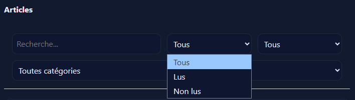

## 6. Import / Export de flux

### 6.1 Exporter

Dans Mes flux :

- OPML : standard pour partager/migrer sa liste de flux.

- JSON : option “withArticles=true” pour inclure les articles.

- CSV : export simple (titre, url, description, catégories).

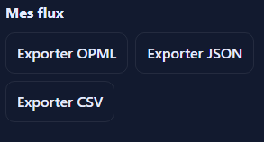

### 6.2 Importer

1. Cliquer sur Choisir un fichier
2. Choisir le fichier dans votre ordinateur à importer
3. Valider, puis cliquer sur Import OPML

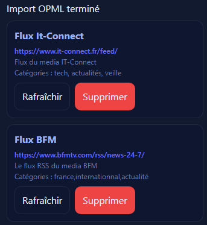

## 7. Glossaire

- Flux RSS/Atom : fichier XML listant les derniers contenus publiés par un site.

- OPML : format XML standard pour l’échange de listes de flux.

- Favori : article marqué comme important.

- Lu/Non lu : statut de lecture pour suivre sa progression.